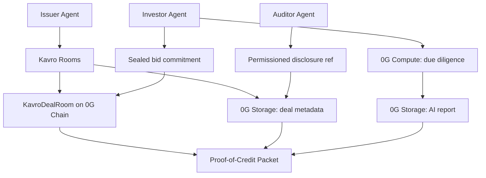

# Kavro Protocol Architecture

Kavro Protocol is a 0G-native private credit clearing network for autonomous agents. It is organized as six layers:

| Layer | Responsibility |
| --- | --- |
| Kavro Rooms | Demo frontend for issuer, investor, and auditor workflows |
| Kavro Underwriting Swarm | Risk, Compliance, Allocation, and Critic agents for private credit decisions |
| Kavro SDK | TypeScript API for contracts, 0G Storage, 0G Compute, and Proof-of-Credit Packets |
| Kavro Contracts | 0G Chain deal lifecycle, commitments, permissions, repayment state |
| Kavro Storage | Encrypted deal memory, AI reports, audit logs, and agent profiles |
| Kavro Compute | Structured private-credit agent analysis |
| Kavro Agent Identity | Agent ID-ready tokenized agent metadata, memory refs, and delegated usage |

## Contract Layer

`KavroDealRoom` records public proof material:

- deal creation with a 0G Storage metadata reference
- funding open / funded / repayment / claim lifecycle
- sealed bid commitments
- AI report hashes and storage refs
- permissioned auditor disclosure refs

`KavroAgentRegistry` registers agent identities and 0G Storage metadata refs.

`KavroAgentID` is an Agent ID-ready prototype. It tokenizes a credit agent identity and stores:

- encrypted metadata ref
- memory ref
- behavior commitment
- usage authorization
- active/inactive status

It is not presented as a full official ERC-7857 implementation; it is a practical bridge toward 0G Agent ID.

## Privacy Model

Kavro does not write plaintext confidential bid amounts to public chain state. Public state contains commitments, storage refs, and event proofs. Sensitive terms belong in encrypted 0G Storage or private compute paths.

## Kavro Underwriting Swarm

Kavro's 0G Compute layer runs four coordinated agents:

- **Risk Agent:** scores the room and identifies credit risks.
- **Compliance Agent:** checks KYC, disclosure scope, and auditability.
- **Allocation Agent:** recommends risk-adjusted investor allocation.
- **Critic Agent:** challenges assumptions, missing data, and weak covenants before the issuer commits funding.

The swarm output becomes part of the Proof-of-Credit Packet.

## Integration Flow

## 0G Mainnet

HackQuest's current submission wording asks for a 0G mainnet contract address. Kavro is configured as a mainnet-only hackathon deployment and has a live mainnet deployment:

- Chain ID: `16661`
- RPC default: `https://evmrpc.0g.ai`
- Explorer: `https://chainscan.0g.ai`
- Script: `npm run deploy:0g`
- KavroDealRoom: `0xbc0d9C0bEe1f914D5b41A250838f3A036F39f669`
- KavroAgentRegistry: `0x2E54CCA69b767A0Ca50906E5F11a58ae437aC3b4`
- KavroAgentID: `0xF4eB358b4110afe87E2fbA6a16AB98DeF0b77d56`
- IdentityRegistry: `0x74Ab9190AB863cF9C430f99CA53ca5599FBD9D77`
- Proof flow: `dealId=4` on `https://chainscan.0g.ai/address/0xbc0d9C0bEe1f914D5b41A250838f3A036F39f669`

## 0G Resource Mapping

Kavro is designed to use 0G's modular stack as infrastructure rather than as an afterthought.

- **0G Storage:** the Log/KV-oriented storage layer is treated as persistent encrypted room memory for deal metadata, AI reports, audit logs, bid-evaluation summaries, and agent profiles.
- **0G Compute Network:** issuer, investor, auditor, allocation, and settlement agents call structured inference endpoints. Production versions can use sealed inference or TEE-backed execution for private credit analysis.
- **0G Compute Direct provider:** Kavro is configured for provider `0xd9966e13a6026Fcca4b13E7ff95c94DE268C471C` at `https://compute-network-1.integratenetwork.work/v1/proxy` with model `zai-org/GLM-5-FP8`. If the base URL is not configured, the server adapter can resolve provider metadata through `@0gfoundation/0g-compute-ts-sdk`.
- **Persistent Memory:** once generally available, Kavro agents can use it for cross-session credit memory, covenant history, investor preferences, and long-context issuer state.
- **Agent ID:** `KavroAgentID` provides an Agent ID-ready prototype for tokenized credit-agent identities with encrypted metadata references, usage authorization, delegated operation, and future composability.
- **Privacy & Security:** Kavro's public contracts store commitments and references; sensitive terms remain encrypted or processed through private execution paths.
