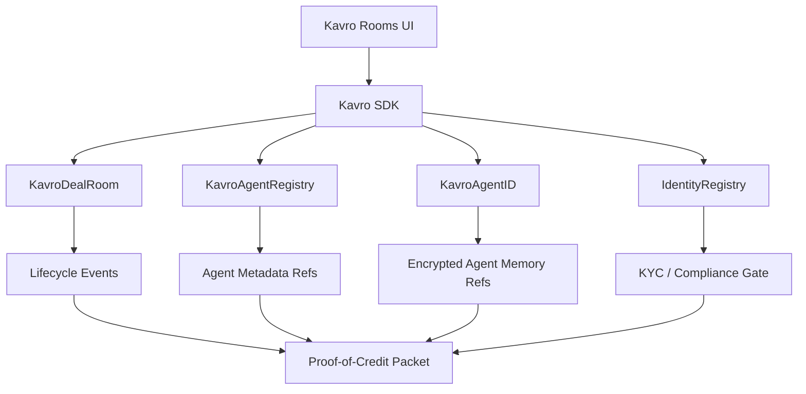
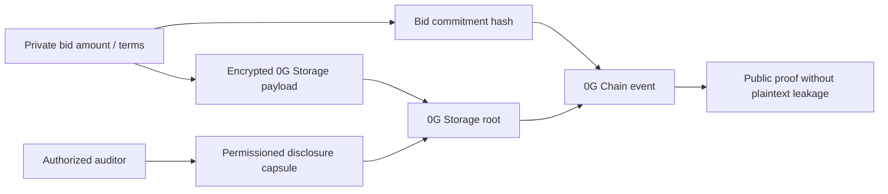
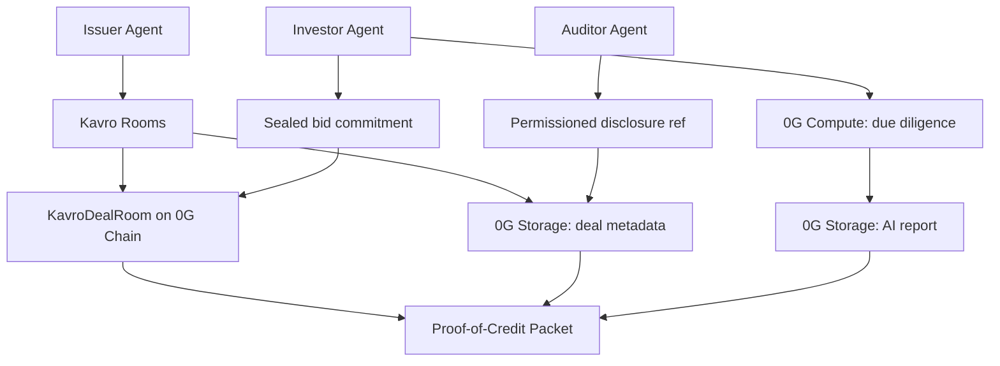
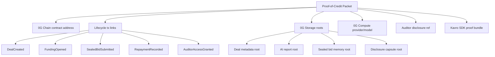
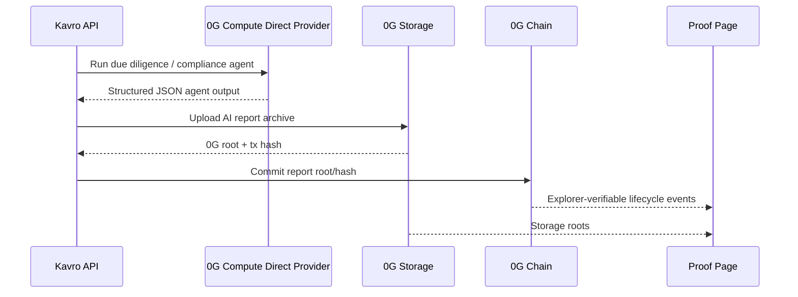

# Kavro Protocol Architecture

Kavro Protocol is a 0G-native private credit clearing network for autonomous agents. It is organized as six layers:

| Layer | Responsibility |
| --- | --- |
| Kavro Rooms | Demo frontend for issuer, investor, and auditor workflows |
| Kavro Underwriting Swarm | Risk, Compliance, Allocation, and Critic agents for private credit decisions |
| Kavro SDK | TypeScript API for contracts, 0G Storage, 0G Compute, and Proof-of-Credit Packets |
| Kavro Contracts | 0G Chain deal lifecycle, commitments, permissions, repayment state |
| Kavro Storage | Encrypted deal memory, AI reports, audit logs, and agent profiles |
| Kavro Compute | Structured private-credit agent analysis |
| Kavro Agent Identity | Agent ID-ready tokenized agent metadata, memory refs, and delegated usage |

## Contract Layer

`KavroDealRoom` records public proof material:

- deal creation with a 0G Storage metadata reference
- funding open / funded / repayment / claim lifecycle
- sealed bid commitments
- AI report hashes and storage refs
- permissioned auditor disclosure refs

`KavroAgentRegistry` registers agent identities and 0G Storage metadata refs.

`KavroAgentID` is an Agent ID-ready prototype. It tokenizes a credit agent identity and stores:

- encrypted metadata ref
- memory ref
- behavior commitment
- usage authorization
- active/inactive status

It is not presented as a full official ERC-7857 implementation; it is a practical bridge toward 0G Agent ID.

## KYC System vs Hackathon Mock Mode

Kavro includes a real compliance gate through `IdentityRegistry`:

- ERC-3643-style investor verification
- admin-controlled registration and revocation via `/admin`
- `KavroDealRoom.submitSealedBid` rejects unverified wallets

For the **hackathon demo**, Kavro adds a mock KYC layer on top of the same on-chain registry:

- any wallet that connects on `/investor` can receive mock KYC automatically
- the app calls `POST /api/demo/mock-kyc` with the connected address
- the server uses the registry admin wallet (`DEPLOYER_PRIVATE_KEY`) to call `registerIdentity`
- after registration, the wallet can call `submitSealedBid` on `KavroDealRoom`

This preserves the real compliance path while removing judge/tester friction. Production should disable mock auto-registration and use a regulated KYC provider instead.

## Privacy Model

Kavro does not write plaintext confidential bid amounts to public chain state. Public state contains commitments, storage refs, and event proofs. Sensitive terms belong in encrypted 0G Storage or private compute paths.

| Data | Public chain? | 0G Storage? | 0G Compute? |
| --- | --- | --- | --- |
| Deal title/category/maturity | Yes, public metadata | Yes | Yes, as public context |
| Bid amount / investor terms | No plaintext | Encrypted or commitment-only | Excluded unless private execution path is configured |
| AI underwriting report | Hash/ref only | Yes | Generated by 0G Compute |
| Auditor disclosure scope | Ref/event only | Yes | Summarized by compliance agent |
| Repayment state | Commitment/event | Optional settlement memo | Used for audit summary |

## Kavro Underwriting Swarm

Kavro's 0G Compute layer runs four coordinated agents:

- **Risk Agent:** scores the room and identifies credit risks.
- **Compliance Agent:** checks KYC, disclosure scope, and auditability.
- **Allocation Agent:** recommends risk-adjusted investor allocation.
- **Critic Agent:** challenges assumptions, missing data, and weak covenants before the issuer commits funding.

The swarm output becomes part of the Proof-of-Credit Packet.

## Integration Flow

## Proof-of-Credit Packet Anatomy

This is the main differentiator versus a simple dApp demo: Kavro creates a portable proof bundle that can be inspected by judges, auditors, or downstream credit-agent developers.

## 0G Mainnet

HackQuest's current submission wording asks for a 0G mainnet contract address. Kavro is configured as a mainnet-only hackathon deployment and has a live mainnet deployment:

- Chain ID: `16661`
- RPC default: `https://evmrpc.0g.ai`
- Explorer: `https://chainscan.0g.ai`
- Script: `npm run deploy:0g`
- KavroDealRoom: `0xbc0d9C0bEe1f914D5b41A250838f3A036F39f669`
- KavroAgentRegistry: `0x2E54CCA69b767A0Ca50906E5F11a58ae437aC3b4`
- KavroAgentID: `0xF4eB358b4110afe87E2fbA6a16AB98DeF0b77d56`
- IdentityRegistry: `0x74Ab9190AB863cF9C430f99CA53ca5599FBD9D77`
- Proof flow: `dealId=4` on `https://chainscan.0g.ai/address/0xbc0d9C0bEe1f914D5b41A250838f3A036F39f669`

## Verified Mainnet Evidence

| Evidence | Value |
| --- | --- |
| Proof deal | `dealId=4` |
| KavroDealRoom | `0xbc0d9C0bEe1f914D5b41A250838f3A036F39f669` |
| Deal metadata root | `0g://0xacbf128bd73766fce19ede54bffb1125910176279f9938e3653c249d33049bf3` |
| AI report root | `0g://0x04f8f52606064971ad3e8c3afe6106cfc7f5dddcced63a931c8003885d764045` |
| Bid memory root | `0g://0x0d042881668629b66256d7c4f6e27367333595d47f204fc30c6546bb2d98eaf4` |
| Disclosure root | `0g://0xfc073ad3e334ade18946bd97c25d918f037054a51763aca0700fc6386d4704cb` |
| 0G Compute provider | `0xd9966e13a6026Fcca4b13E7ff95c94DE268C471C` |
| 0G Compute model | `zai-org/GLM-5-FP8` |

## 0G Resource Mapping

Kavro is designed to use 0G's modular stack as infrastructure rather than as an afterthought.

- **0G Storage:** the Log/KV-oriented storage layer is treated as persistent encrypted room memory for deal metadata, AI reports, audit logs, bid-evaluation summaries, and agent profiles.
- **0G Compute Network:** issuer, investor, auditor, allocation, and settlement agents call structured inference endpoints. Production versions can use sealed inference or TEE-backed execution for private credit analysis.
- **0G Compute Direct provider:** Kavro is configured for provider `0xd9966e13a6026Fcca4b13E7ff95c94DE268C471C` at `https://compute-network-1.integratenetwork.work/v1/proxy` with model `zai-org/GLM-5-FP8`. The production server adapter calls this 0G Compute endpoint directly so Vercel does not need runtime provider metadata discovery.
- **Persistent Memory:** once generally available, Kavro agents can use it for cross-session credit memory, covenant history, investor preferences, and long-context issuer state.
- **Agent ID:** `KavroAgentID` provides an Agent ID-ready prototype for tokenized credit-agent identities with encrypted metadata references, usage authorization, delegated operation, and future composability.
- **Privacy & Security:** Kavro's public contracts store commitments and references; sensitive terms remain encrypted or processed through private execution paths.
