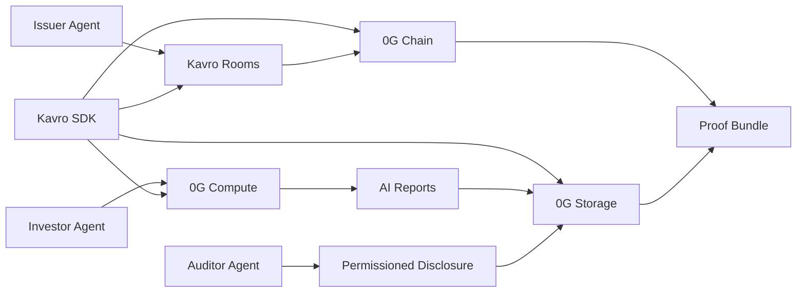
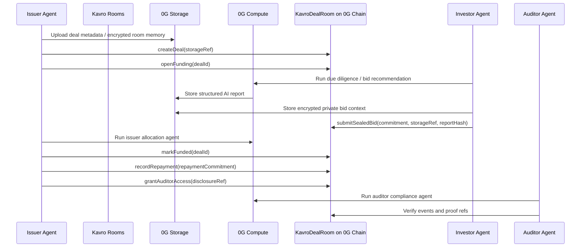

# Kavro Protocol

**0G-native confidential credit-agent infrastructure for sealed RWA funding.**

Kavro Protocol lets issuer, investor, and auditor agents privately evaluate, bid, disclose, and settle RWA credit funding rounds using 0G Storage, 0G Compute, and on-chain commitments.

## What It Does

Kavro is a framework for private credit agents, not a single-purpose deal room. Issuers create sealed funding rooms, investors submit confidential bid commitments, AI agents generate private due diligence and allocation recommendations, repayments settle on-chain, and auditors receive permissioned disclosure without exposing sensitive deal terms publicly.

## Why It Matters

Private credit and RWA funding still run through emails, PDFs, spreadsheets, and lawyer-controlled data rooms. Public blockchains improve settlement, but they expose bid sizes, allocations, investor appetite, and repayment exposure. Kavro separates public commitments from private credit intelligence.

## Why 0G

- **0G Storage** stores encrypted deal memory, AI reports, audit logs, allocation summaries, and agent metadata.
- **0G Compute** runs due diligence, risk scoring, bid recommendation, issuer allocation analysis, and auditor summaries.
- **0G Chain** records deal lifecycle events, bid commitments, auditor permissions, repayment commitments, and settlement proofs.
- **Agent architecture** makes the workflow reusable beyond one demo app.

## Architecture



## Protocol Flow



## Smart Contracts

- `contracts/KavroDealRoom.sol` — creates rooms, opens funding, accepts sealed bid commitments, commits AI report refs, records repayment commitments, handles claim requests, and grants auditor access.
- `contracts/KavroAgentRegistry.sol` — registers issuer, investor, auditor, settlement, and due diligence agents with 0G Storage metadata refs.
- `contracts/IdentityRegistry.sol` — ERC-3643-style compliance gate for verified investor addresses.
- ERC-7857 / Agent ID is documented as a roadmap extension; this repo does not fake a full ERC-7857 implementation.

## SDK Usage

```ts
import { createKavroClient } from "@/sdk";

const kavro = createKavroClient({
  chainId: 16602,
  dealRoomContract: process.env.NEXT_PUBLIC_KAVRO_DEAL_ROOM_ADDRESS as `0x${string}`,
  agentRegistryContract: process.env.NEXT_PUBLIC_KAVRO_AGENT_REGISTRY_ADDRESS as `0x${string}`,
  explorerUrl: "https://chainscan-galileo.0g.ai",
  publicClient,
  walletClient
});

const dealRef = await kavro.uploadDealTo0G({
  title: "Atlas Receivables Series A",
  category: "Private Credit",
  maturityDate: "2026-12-31",
  description: "Receivables-backed credit room"
});

await kavro.createDealRoom({
  title: "Atlas Receivables Series A",
  category: "Private Credit",
  maturityDate: "2026-12-31",
  description: "Receivables-backed credit room",
  storageRef: dealRef.uri
});

await kavro.runDueDiligence({ title: "Atlas Receivables Series A", confidentialAmountsExcluded: true });
await kavro.submitSealedBid({ dealId: 0n, bidSecret: "private terms", storageRef: dealRef.uri });
const proof = kavro.getDealProofBundle({ dealId: "0", dealStorageRef: dealRef.uri });
await kavro.verifyDealProof(proof);
```

## 0G Integration Proof

- 0G Chain contract address: `NEXT_PUBLIC_KAVRO_DEAL_ROOM_ADDRESS` after deployment.
- 0G Explorer link: `https://chainscan-galileo.0g.ai/address/<contract>`.
- 0G Storage references: generated during the demo by `src/lib/0g/storage.ts`.
- 0G Compute provider/model: configured with `0G_COMPUTE_API_KEY`, `NEXT_PUBLIC_0G_COMPUTE_ROUTER_URL`, and `NEXT_PUBLIC_0G_COMPUTE_MODEL`.
- AI report hash/reference: returned by `/api/0g/agent` and shown in the UI.

Local development has a clearly labeled `local-dev` fallback when 0G keys are missing. The fallback never claims to be a real 0G upload or inference.

## Local Setup

```bash
npm install
cp .env.example .env.local
npm run compile:contracts
npm run dev
```

Optional real 0G Storage SDK install:

```bash
npm run install:0g-storage
```

Deploy to 0G Galileo:

```bash
export DEPLOYER_PRIVATE_KEY=0x...
npm run deploy:0g
```

Then copy the printed addresses into `.env.local`.

## Demo Script Under 3 Minutes

1. Open `/demo` and show the 0G Galileo network, explorer, and proof flow.
2. Go to `/issuer`, create a Kavro Room, and point out the 0G Storage metadata ref.
3. Open funding and show the 0G Chain transaction link.
4. Go to `/investor`, run 0G Due Diligence and Investor Bid Recommendation.
5. Store private bid context, submit a sealed bid commitment, and show the tx hash.
6. Return to `/issuer`, generate allocation plan, mark funded, and record repayment commitment.
7. Go to `/auditor`, grant disclosure and generate the auditor compliance summary.
8. Open `/proofs` and show the proof bundle format.

## Known Limitations

- Demo metadata is sample RWA/private credit data.
- Production deployments need regulated KYC providers and institutional custody flows.
- Confidential bid amount encryption depends on the selected privacy provider or TEE path. Kavro’s default contract stores commitments and encrypted storage references.
- Real 0G Storage and 0G Compute require configured keys/providers. Local fallback is development-only.
- ERC-7857 / Agent ID integration is planned as an extension, not claimed as complete here.

## Roadmap

- Agent marketplace for private credit agents.
- DAO treasury credit rounds.
- Multi-chain RWA settlement.
- Institutional auditor dashboard.
- Full Agent ID / ERC-7857-style encrypted metadata integration.
- Private strategy and bid optimization agents.

## Official 0G References

- https://docs.0g.ai/developer-hub/building-on-0g/storage/sdk
- https://docs.0g.ai/developer-hub/building-on-0g/compute-network/inference
- https://docs.0g.ai/developer-hub/building-on-0g/contracts-on-0g/deploy-contracts
- https://docs.0g.ai/developer-hub/testnet/testnet-overview
- https://docs.0g.ai/developer-hub/building-on-0g/inft/erc7857
